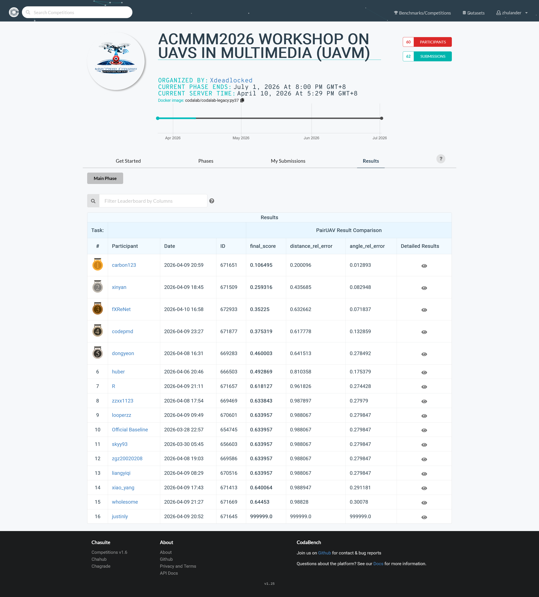

# fXReNet for PairUAV (UAVM 2026)

<div align="center">
  
</div>

This repository contains my PairUAV challenge pipeline for ACM MM 2026 UAVM.

## Leaderboard Result

Participant name: **fXReNet**

- Rank: **#3**
- final_score: **0.35225**
- distance_rel_error: **0.632662**
- angle_rel_error: **0.071837**



## Benchmark: From 1.27 to 0.35

My first serious upload had a **final_score = 1.270123**. The root issue was a post-processing mistake in distance handling: many predictions were emitted as negative values, which are physically invalid for this task and heavily penalized by the relative distance metric.

After fixing the output constraints and tightening the submission-generation path, the score improved substantially to **0.35225** with much better balance between distance and angle error.

## Architecture Overview

The final model family is based on `HARPDualPath` in `models/harp_dual_path.py`, composed of:

1. **Shared spatial backbone**
  - ResNet-50 feature extractor returning `7x7x2048` maps.
  - Frozen in early phases, unfrozen only in the final fine-tuning phase.

2. **Dense correlation volume + spatial fusion**
  - Source/target feature maps are matched via a dense correlation volume.
  - A lightweight fusion block converts correlations into a compact spatial tensor.

3. **Wide Path (global estimate)**
  - Fast global regression for heading and distance.
  - Also predicts confidence for uncertainty-aware losses.

4. **Deep Path (local refinement)**
  - Region-level pose refinement from spatial grids.
  - Precision map re-weights local predictions before aggregation.

5. **Cross-Residual Gate (fXReNet core idea)**
  - A gated residual module predicts a correction `delta = [d_heading, d_distance]` from wide-path outputs.
  - The same gate also modulates confidence.
  - Intuition: global estimate first, then controlled correction rather than full overwrite.

## Training Strategy (3 Phases)

Implemented in `training/train_dual_path.py` with the phase schedule:

1. **Phase 1 (coarse stabilization)**
  - Epochs: 20
  - LR: `5e-4`
  - Batch size: 256
  - Backbone: frozen
  - Gate: off

2. **Phase 2 (refinement + gating)**
  - Epochs: 15
  - LR: `1e-4`
  - Batch size: 256
  - Backbone: frozen
  - Gate: on

3. **Phase 3 (joint fine-tuning)**
  - Epochs: 10
  - LR: `1e-5`
  - Batch size: 128
  - Backbone: unfrozen
  - Gate: on

### Losses

- Base objective: Laplace-style uncertainty-aware regression (`laplace_nll` in `training/loss.py`).
- Phase 2 adds deep-path auxiliary supervision (`wrapped_angle_loss` + distance L1) with a weighted auxiliary term.
- Checkpoint selection follows leaderboard priority (`final_score`, then `distance_rel_error`, then `angle_rel_error`) to align training with competition ranking.

## Pipeline and Reproducibility

The end-to-end runner is `scripts/run_everything.py`, which orchestrates:

1. dataset preparation,
2. CPU smoke checks,
3. phased training,
4. inference for `result.txt`,
5. packaging to `result.zip`.

Typical run:

```bash
python scripts/run_everything.py \
  --mode dual-path \
  --phases 1,2,3 \
  --raw true \
  --official-annotations true
```

Submission generation uses strict ordering and format checks in `scripts/generate_submission.py` with `--safe-submission-mode`.

## Frieren-Inspired Design Philosophy

The system design was inspired by *Frieren* in a practical engineering sense:

- **Human v. Elf**: Wide path representing more capability but less temporal awareness, whilst Deep part represents the shorter lifespan with less capability but more iterations
- **Cross residual**: Not an original idea, but used to pass parts, not full data where deep and wide can learn from each other

## Environment Notes

- 镜像 PyTorch  2.8.0 Python  3.12(ubuntu22.04) CUDA: 12.8 GPU: RTX 3080 Ti(12GB) * 1 CPU: 10 vCPU Intel(R) Xeon(R) Gold 6248 CPU @ 2.50GHz 内存45GB
- Python and dependency setup follow the challenge starter kit and `requirements.txt`.

## Acknowledgements

- This solution uses the official UAVM 2026 starter kit and PairUAV benchmark. The University-1652 dataset and data preparation scripts are based on the publicly available University-1652 baseline and UAVM_2026 repository. Backbone features use ImageNet-pretrained ResNet-50 weights.
